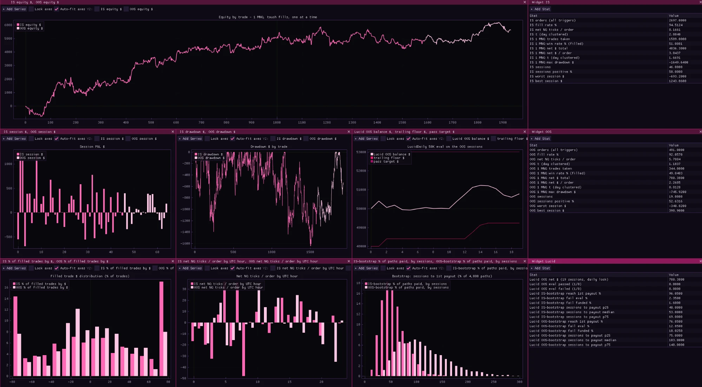

# AZBacktest: C++ Backtesting Framework for Tick Data

### **Docs are in wiki!**

**Before building, edit `config.toml` to map your data columns and set the data path. If the file doesn't exist, the first run will generate one with placeholder values.**

AZBacktest is a C++17 backtesting framework for algorithmic trading strategies on tick data. Header-only API (also available as a single-header amalgamation), CSV and Parquet data support (Databento-style formats work out of the box), and an ImGui/ImPlot visualization window.

Note: Release files are frequently out of date. Clone and build the project if its missing a feature you require.  

## Build

```bash
# run a strategy
bash build.sh -runfile exampleStrategies/BuyAndHold.cpp

# generate single-header amalgamation (azbacktest.h)
bash build.sh

# build and run the unit tests
bash build.sh -tests

# clean leftover build artifacts
bash build.sh -clean
```

Requires g++ with C++17 (C++20 if Parquet support is linked in, see below), GLFW and OpenGL (vendored under `vendor/`).

## Tests

Tiny note: All tests (that I commited, that is) are AI written. I plan to be transparent on my AI use for this project, which is why I am adding this.    

`bash build.sh -tests` compiles every `tests/test_*.cpp` and runs them, printing a line per test plus a per-suite summary. It exits non-zero if anything fails, so CI can gate on it.

Each test file becomes its **own binary** rather than one linked suite. `backtestApi.h` declares `trades`, `realizedProfit`, and `equityCurve` as non-`inline` globals, so two test TUs including it would collide at link time. Separate binaries also stop the global `kCSVMapping` leaking between files.

Tests run on fake data: `tests/fakeData.h` provides a `TempCsv` helper that writes a fixture to a scratch file and deletes it on destruction, so nothing is checked into the repo and each test states the rows it cares about right next to its assertions. `azt::useFixtureMapping()` points `kCSVMapping` at the shared fixture layout; call it at the top of any test that reads data, then override whichever fields the test is exercising.

Adding a test:

```cpp
#include "tests/testFramework.h"
#include "tests/fakeData.h"
#include "src/marketData.h"

TEST(myThingWorks) {
    azt::useFixtureMapping();
    azt::TempCsv csv(azt::basicTicks());
    MarketData md(csv.path());

    auto t = md.nextTick();
    REQUIRE(t.has_value());   // fatal, bails out of this test
    CHECK_F(t->size, 3.f);    // non-fatal, keeps going
}
```

No `main()` needed, `testFramework.h` supplies one. Assertions are `CHECK`, `CHECK_EQ`, `CHECK_NE`, `CHECK_NEAR`, `CHECK_F` (float compare at a fixed tolerance), and `REQUIRE`. Everything except `REQUIRE` is non-fatal, so one run surfaces every problem in a test rather than stopping at the first.

Fixtures are CSV, so the Parquet backend isn't covered by these.

## Configuration

Edit `config.toml` to point at your data file (CSV or Parquet, see below) and map column indices.
If `config.toml` doesn't exist, the first run will generate one with placeholder values and exit so you can fill it in.
Note: If you use the header file (from releases) you'd have to search for the mapping itself, and change it directly.

```toml
# absolute path to the data file (CSV or Parquet)
path = "C:/path/to/your/data.csv"

# column indices (0-indexed)
# tsRecvCol is the timestamp used for bar windowing/sorting - if your data
# doesn't distinguish recv/event time, just point it at whatever column
# carries the timestamp
tsRecvCol = 0
priceCol  = 8
sizeCol   = 9

skipHeader = true

# event timestamp + row/sequence number columns, set either to -1 to disable
# on Databento TBBO these are ts_event and sequence
tsEventCol   = -1
rowNumberCol = -1

# symbol filtering (set symbolCol to -1 to disable)
symbolCol  = -1
symbol     = ""
symbolRoll = false

# aggressor/side classification (set aggressor to -1 to disable)
# these are the literal strings in your side column, not fixed labels - check
# them against your data. Databento, for one, encodes the initiating side, so
# it's "B" (bid side / buy aggressor) and "A" (ask side / sell aggressor)
aggressor                = -1
buySideAggressorAlias    = "B"
sellSideAggressorAlias   = "S"
unknownSideAggressorAlias = "N"

# resting (top-of-book) size columns (set to -1 to disable)
# a per-row snapshot of what's sitting on each side of the book, not traded
# volume - on Databento TBBO these are bid_sz_00 / ask_sz_00
restingBidCol = -1
restingAskCol = -1

# best bid/ask price columns (set to -1 to disable)
# quote snapshots at the time of each row, on Databento TBBO these are
# bid_px_00 / ask_px_00. Parquet sources need them as doubles
bidPriceCol = -1
askPriceCol = -1

# book-event classification (set actionCol to -1 to disable)
# a per-row snapshot like the resting/bid-ask columns, not summed across a bar
# these are the literal strings in your action column - Databento's MBO/MBP
# schemas use A/C/M/T/F/R for Add/Cancel/Modify/Trade/Fill/Clear(book reset),
# anything else (including a disabled column) lands on actionNoneAlias
actionCol         = -1
actionAddAlias    = "A"
actionCancelAlias = "C"
actionModifyAlias = "M"
actionTradeAlias  = "T"
actionFillAlias   = "F"
actionClearAlias  = "R"
actionNoneAlias   = "N"

# trading costs (all in pts)
commission = 0.0
spread     = 0.0
timingCost = 0.0

# substring offsets for pulling Y/M/D out of the timestamp column
# defaults match Databento's ISO-8601 format: 2025-06-01T22:00:00.065308005Z
[dateFormat]
yearOffset  = 0
yearLength  = 4
monthOffset = 5
monthLength = 2
dayOffset   = 8
dayLength   = 2
```

Note: I realize the vibecoded system for registering a column is overly complex, after doing it myself for `action`.   
I will eventually write a guide and simplifiy the system. 
